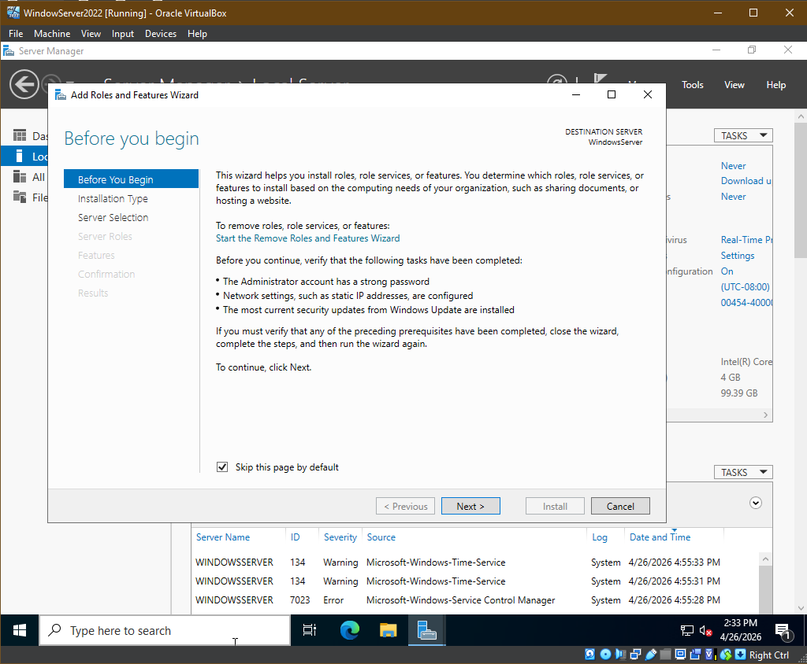
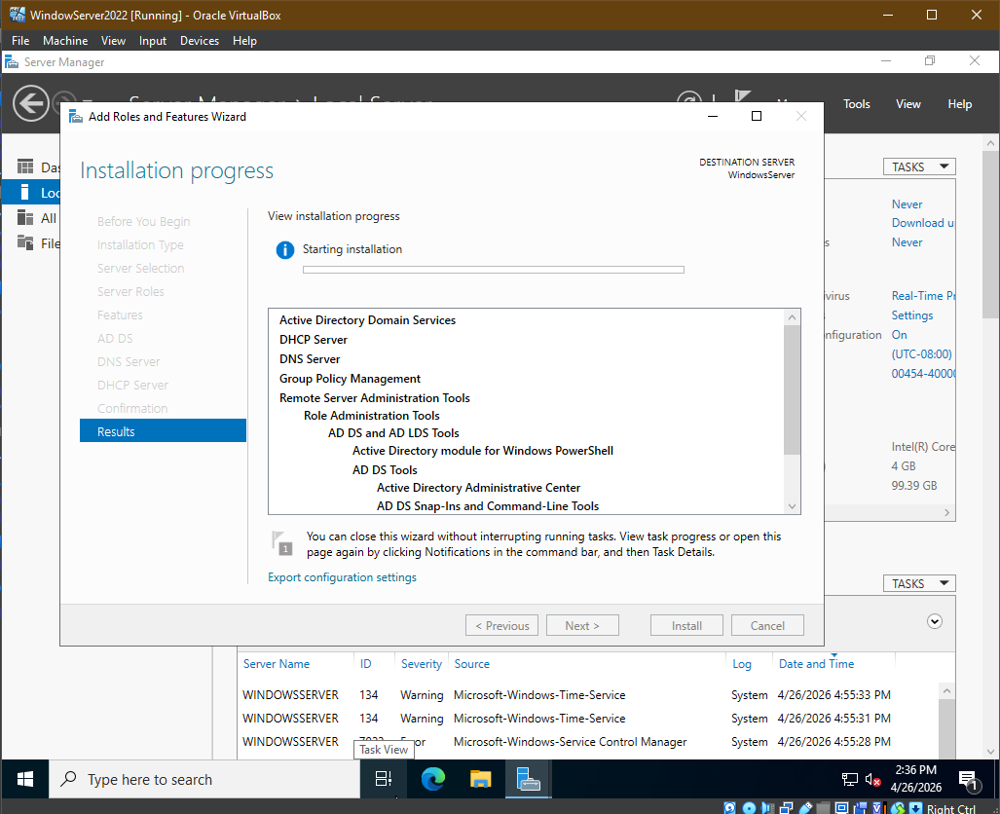

<h2>Add Active Directory roles and features:</h2>
 
- <b>After logging into admin account, select "Manage"</b>
 
 

- <b>Select "Add Roles and Features", roles and features selection window will prompt</b>
  

 
- <b>Select "Active Directory Domain Services"</b>
 
 

- <b>Finish Install, will require a reboot</b>

 
- <b>Will have to login back in using administrator information</b>
 
- <b>Server Manager will open, select Tools, Active Directory will now be listed as an option</b>
 

